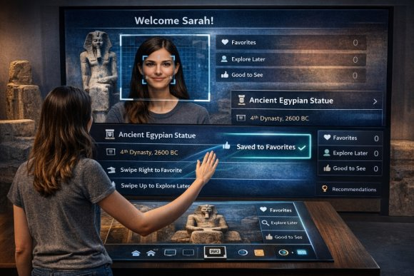
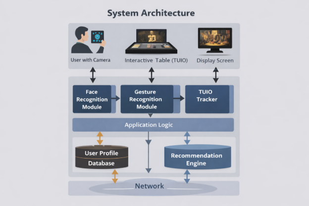
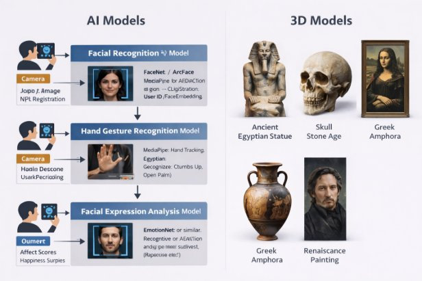

**Project Documentation**

**MuseSense: Tangible + Gesture + Face Interactive Museum Guide (HCI Project)**

**1) Project Summary**

**MuseSense** is an interactive museum experience where visitors explore exhibits using **TUIO tangible markers** (physical cards/tokens placed on a table), **hand gestures** (to curate lists and control views), and **facial expression analysis** (for login + emotion-aware personalization).

Visitors can:

- Place a tangible marker representing an artifact/exhibit on an interactive surface to instantly view it in 2D/3D with media, context, and recommendations.
- Use hand gestures to quickly save items into personal lists: **Favorites**, **Explore Later**, and **Good to See**.
- Log in / register using face-based identity verification, and optionally enable **emotion-aware personalization** where the system uses their facial expression (e.g., happiness) and perceived engagement to recommend categories.

**Goal:** Improve engagement, reduce friction in navigation, and make exploration playful and accessible using multi-modal HCI interaction.

**2) Course Requirements Coverage**

**Requirement A — TUIO Markers**

- Each artifact has a **printed marker/token**.
- When placed on the interactive table, the system detects the marker via **TUIO protocol** and loads artifact content.
- Moving/rotating the token changes the view (e.g., rotate to rotate a 3D model, slide to scrub timeline).

**Requirement B — Facial Expression**

- Used for **login/register** (face recognition/verification).
- Used optionally for **emotion signals**:
  - Detect happiness/interest cues while viewing artifacts.
  - Support “mood-aware recommendations” and “engagement score” per category.

**Requirement C — Hand Gestures**

- Gesture-based actions:
  - **Swipe Right**: Save to Favorites
  - **Swipe Up**: Add to Explore Later
  - **Pinch**: Zoom artifact image/model
  - **Open Palm**: Return Home / Hide panels
  - **Thumbs Up**: “Good to See” (quick positive marker)
-----
**3) Problem Statement**

Traditional museum experiences can be:

- Passive (read-only labels)
- Overwhelming (too many artifacts, limited personalization)
- Slow to navigate (menus, scanning QR, typing searches)

**MuseSense** solves this by providing a **natural interaction** system that is:

- Physical (tangible tokens)
- Expressive (gesture control)
- Personal (face login + emotion-aware recommendations)
-----
**4) Objectives (HCI-Oriented)**

1. **Reduce Interaction Friction**\
   Replace complex menus with physical tokens and gestures.
1. **Increase Engagement & Enjoyment**\
   Encourage playful exploration and curiosity-driven browsing.
1. **Support Personalization**\
   Visitor profiles store preferences and generate recommendations.
1. **Make Interaction Learnable and Accessible**\
   Provide clear affordances, guided hints, and alternative actions.
-----
**5) Target Users & Personas**

**Persona 1: “Casual Visitor”**

- Wants quick, fun exploration.
- Doesn’t want to type or read long text.
- Benefit: tokens + gesture saves + short summaries.

**Persona 2: “Student Researcher”**

- Wants deep context and ability to collect items.
- Benefit: saved lists, categories, history, export notes (optional feature).

**Persona 3: “Family / Group”**

- Wants interactive playful experience.
- Benefit: multi-user mode and “group favorites” (optional feature).
-----
**6) Core Features**

**6.1 Tangible Artifact Exploration (TUIO)**

**Interaction**

- Place artifact marker → artifact page opens
- Rotate token → rotate 3D model / image
- Move token closer/farther → zoom or switch detail level

**Output**

- Artifact title, era, story, fun facts
- 3D preview or image carousel
- Related artifacts (“Similar style / period / artist”)
-----
**6.2 Face Login / Registration + Expression Awareness**

**Login/Register**

- Visitor stands in front of the kiosk camera.
- Face is used to authenticate and load personal profile.

**Expression Awareness (Opt-in)**

- While viewing artifacts, the system measures “positive affect” signals (e.g., smiles).
- It updates a lightweight “interest score” per category.

Important HCI note: This must be presented as **optional** with consent and privacy notice.

-----
**6.3 Gesture-Based List Curation**

Each user has 3 sets:

- **Favorites**: “I love this”
- **Explore Later**: “I want to revisit”
- **Good to See**: “Worth recommending / nice”

**Gestures**

- Swipe right → Favorites
- Swipe up → Explore Later
- Thumbs up → Good to See
- Pinch → zoom
- Open palm → back/home

**Feedback**

- Clear visual confirmations: icon + short toast (“Saved to Favorites ✅”)
- Undo gesture/button for safety
-----
**7) Additional Features (Recommended to Strengthen the Project)**

These are great for HCI grading because they add usability, accessibility, and evaluation depth:

**Feature 1 — Guided Onboarding (“How to Use” Overlay)**

- First-time users see a 20–30 second tutorial with animations:
  - “Place token here”
  - “Swipe to save”
  - “Rotate token to rotate the artifact”

**Feature 2 — Multi-User Mode (Two Visitors at One Table)**

- Support two profiles by:
  - two camera zones, or
  - “tap your profile token” to switch active user
- Split screen or color-coded UI.

**Feature 3 — Accessibility Mode**

- Gesture alternatives as on-screen buttons.
- Larger text mode.
- High-contrast mode.
- Audio narration (optional).

**Feature 4 — “Museum Trail / Quest”**

- The system builds a personalized trail: “5 artifacts you’ll love”
- It uses your saved lists + engagement signals.

**Feature 5 — Takeaway Summary (Export)**

- At the end, generate a QR code for the visitor:
  - their favorites list
  - short descriptions
  - recommended next exhibits

(Export feature is very attractive in demos.)

-----
**8) System Functional Requirements**

**FR1 — Marker Detection (TUIO)**

- System shall detect marker ID, position, and rotation.
- System shall load the artifact mapped to marker ID within ≤ 1 second.

**FR2 — Artifact View**

- System shall display artifact media and metadata.
- System shall support 2D/3D view mode switching.

**FR3 — Gesture Recognition**

- System shall recognize at least 5 gestures reliably.
- System shall provide real-time feedback for recognized gestures.

**FR4 — User Profile**

- System shall create and store profiles.
- System shall save lists (Favorites, Explore Later, Good to See).
- System shall maintain viewing history.

**FR5 — Face Login + Opt-in Emotion**

- System shall support face-based login/verification.
- System shall require consent before enabling expression-based personalization.
-----
**9) Non-Functional Requirements**

- **Usability:** learnable within 2 minutes for first-time users
- **Responsiveness:** 30 FPS tracking (if possible), low latency feedback
- **Privacy:** store minimal biometric data, consent + delete option
- **Reliability:** graceful fallback when face/gesture fails
- **Security:** encrypted storage for user profiles (if networked)
-----
**10) Interaction Design**

**10.1 Main User Flow**

1. **Welcome Screen**
1. **Face Login/Register**
1. **Explore Mode**
   1. Place marker to open artifact
   1. Gesture to save to lists
1. **Recommendations**
   1. Based on lists + optional expression signals
1. **End Session**
   1. summary + optional QR export

**10.2 Key Screens**

- Welcome / Consent
- Login/Register
- Artifact Viewer
- Lists Dashboard
- Recommendations / Trail
- Session Summary

**10.3 Feedback & Error Prevention**

- Every recognition action must show:
  - **Visual feedback** (highlight marker, gesture icon)
  - **Audio or haptic** (optional)
- Misrecognition handling:
  - “Undo” option for saves
  - “Try again” prompt for face login
  - fallback buttons for list actions
-----
**11) Data Model (Conceptual)**

**User**

- userId
- faceTemplateHash (or embedding if used)
- consentFlags (faceAuth, emotionPersonalization)
- favorites[]
- exploreLater[]
- goodToSee[]
- categoryScores { ancient, modern, sculpture, … }

**Artifact**

- artifactId
- name, era, category, description
- media (images, 3D model)
- tuioMarkerId

**Events (for analytics/evaluation)**

- markerPlaced, markerRemoved
- gestureRecognized
- listAdd/listRemove
- sessionDuration
- recommendationClicks
-----
**12) Technical Implementation Plan (High-Level)**

**12.1 Hardware Setup**

- Camera above table (marker + gesture tracking)
- Optional separate camera for face login kiosk (or same camera with different mode)
- Large screen or projector display

**12.2 Suggested Software Stack (Example)**

- **TUIO tracking:** reacTIVision / any TUIO server + your client app
- **Client UI:** Web app (React) or Unity
- **Gesture + Face:** MediaPipe + face expression model (or OpenCV-based pipeline)
- **Backend:** Node.js + MongoDB (optional; local-only storage also possible)

For a course project, you can implement everything locally and simulate backend with JSON storage if needed.

-----
**13) Ethics, Privacy, and Consent**

Because face data is sensitive:

- Show a **consent screen** clearly stating:
  - what is collected (face for login, expression for personalization)
  - why it’s collected
  - where it’s stored
  - delete option
- Provide **“Continue as Guest”** mode:
  - no face storage
  - only temporary session lists
-----
**14) HCI Evaluation Plan**

**14.1 Study Design**

- Participants: 8–15 users (students/friends)
- Tasks:
  - Log in / continue as guest
  - Explore 3 artifacts using markers
  - Save 1 item to each list using gestures
  - Find and open favorites list
  - Follow one recommendation

**14.2 Metrics**

- Task completion rate (%)
- Time on task (seconds)
- Error rate (misrecognition, wrong list)
- Learnability (time to first correct gesture)
- Satisfaction (SUS questionnaire or 1–5 Likert)
- Qualitative feedback (short interview)

**14.3 Expected Findings**

- Tangible interaction improves discoverability.
- Gesture saves reduce menu navigation time.
- Face login reduces typing, but requires clear consent + fallback.
-----
**15) Project Milestones (Suggested 4–6 Weeks)**

1. Week 1: Requirements + UI wireframes + marker mapping
1. Week 2: TUIO integration + artifact viewer
1. Week 3: Gesture recognition + list curation
1. Week 4: Face login + profile storage
1. Week 5: Recommendations + onboarding + accessibility
1. Week 6: Evaluation + report + demo polishing
-----
**16) Risks & Mitigation**

- **Gesture misrecognition** → add fallback buttons + simpler gesture set
- **Lighting issues for markers** → controlled lighting + calibration
- **Face privacy concerns** → guest mode + opt-in + delete profile
- **Complexity creep** → lock MVP early (TUIO + 3 gestures + basic login)
-----
**17) MVP Definition (What You Must Deliver)**

Minimum to satisfy the course requirements cleanly:

- TUIO markers load artifacts (at least 6 artifacts)
- Face login/register OR guest mode (but face must be implemented)
- 5 gestures: swipe right/up, pinch, open palm, thumbs up
- Lists: Favorites / Explore Later / Good to See
- Basic recommendations by category

 pg. 2
